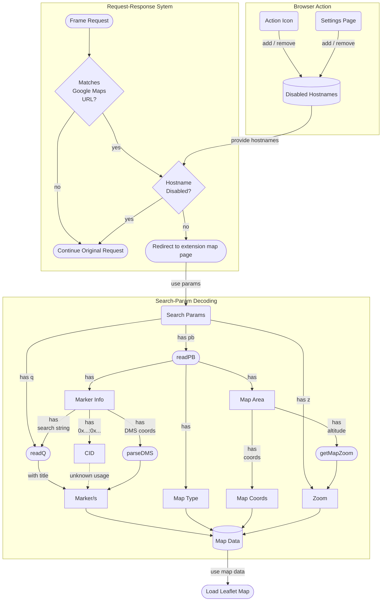

# Replace Maps

Replace Google Maps iFrames with OpenStreetMap

## How it Works

This browser extension intercepts web requests from frames in a page.
If the request URL matches the syntax to a Google Maps map, the response will be replaced.
The search parameters of the request are decoded and converted to compatible syntax.
As a result, the response is an extension page that contains a [Leaflet](https://leafletjs.com/) & [OSM](https://www.openstreetmap.org/) map.

You can turn the extension off for every hostname by using the browser action button or by using the settings page.

### Extension Flowchart

